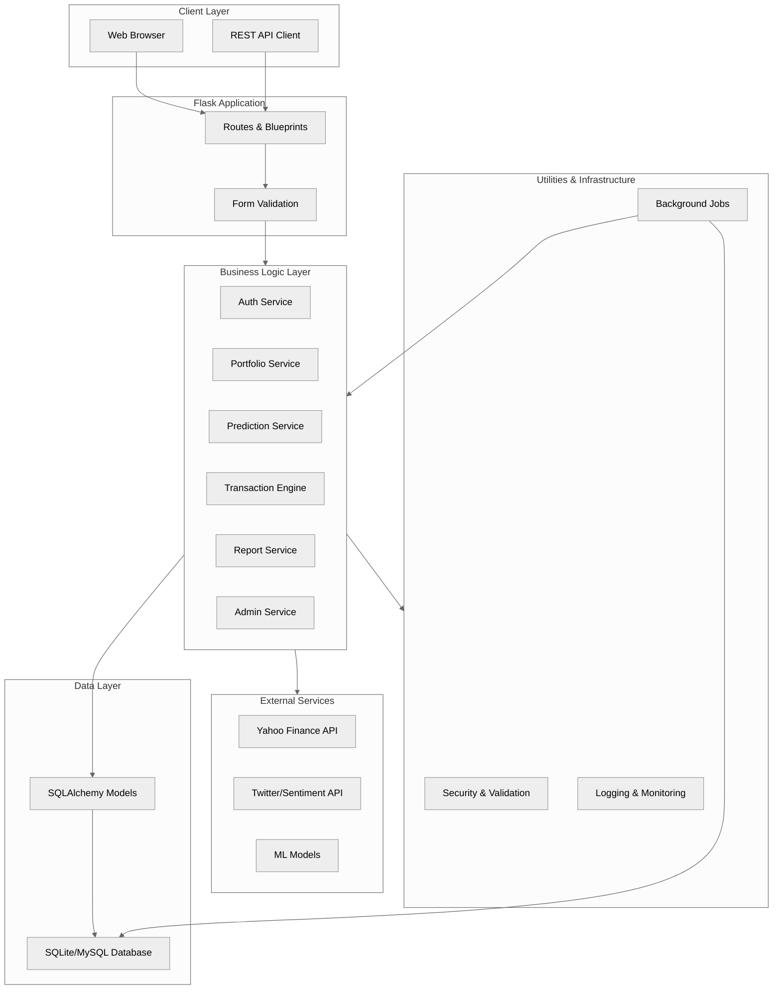

# System Architecture

## High-Level Architecture Overview

```mermaid
%%{init: {'theme':'neutral'}}%%
graph TB
    subgraph Client["Client Layer"]
        Web["Web Browser"]
        API["REST API Client"]
    end
    
    subgraph Flask["Flask Application"]
        Routes["Routes & Blueprints"]
        Forms["Form Validation"]
    end
    
    subgraph Business["Business Logic Layer"]
        Auth["Auth Service"]
        Portfolio["Portfolio Service"]
        Prediction["Prediction Service"]
        Transaction["Transaction Engine"]
        Reports["Report Service"]
        Admin["Admin Service"]
    end
    
    subgraph Data["Data Layer"]
        Models["SQLAlchemy Models"]
        DB["SQLite/MySQL Database"]
    end
    
    subgraph External["External Services"]
        YFinance["Yahoo Finance API"]
        Twitter["Twitter/Sentiment API"]
        ML["ML Models"]
    end
    
    subgraph Utils["Utilities & Infrastructure"]
        Security["Security & Validation"]
        Logging["Logging & Monitoring"]
        Jobs["Background Jobs"]
    end
    
    Web --> Routes
    API --> Routes
    Routes --> Forms
    Forms --> Business
    Business --> Models
    Models --> DB
    Business --> External
    Business --> Utils
    Jobs --> Business
    Jobs --> DB
```
