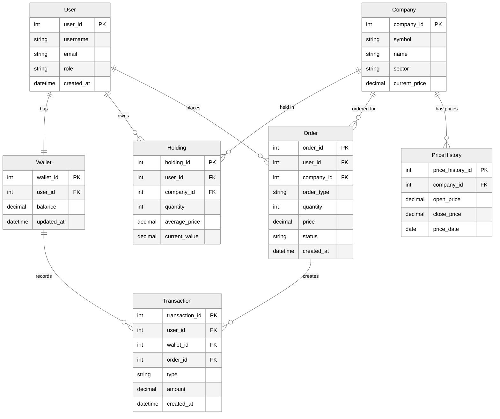

# Database Entity-Relationship Diagram

## Metadata
- Generated: 2025-11-19
- Generator: Manual
- Source: Stock Portfolio Platform Models

## Diagram

## Key Relationships

### User-Centric Relationships
- **User → Wallet**: One-to-Many (A user has one wallet for managing funds)
- **User → Holdings**: One-to-Many (A user can own multiple stock holdings)
- **User → Orders**: One-to-Many (A user can place multiple buy/sell orders)
- **User → Transactions**: One-to-Many (A user has transaction history)
- **User → Notifications**: One-to-Many (A user receives notifications)

### Company-Centric Relationships
- **Company → Holdings**: One-to-Many (A company's stock can be held by multiple users)
- **Company → Orders**: One-to-Many (A company's stock can have multiple orders)
- **Company → PriceHistory**: One-to-Many (A company has historical price data)
- **Company → Dividend**: One-to-Many (A company can pay multiple dividends)
- **Company → Broker**: Many-to-One (Companies are listed with brokers)

### Transaction Flow
- **Order → Transaction**: One-to-One (An executed order creates a transaction)
- **Wallet → Transaction**: One-to-Many (Wallet records all transactions)

## Business Rules

1. **User Management**: Users have roles (admin/user) with different permissions
2. **Portfolio Tracking**: Holdings track quantity, average price, and unrealized gains
3. **Order Processing**: Orders go through states (pending → executed/cancelled)
4. **Wallet Management**: Wallet balance updated with deposits, withdrawals, and trades
5. **Commission Tracking**: Each order includes broker commission
6. **Dividend Processing**: Dividends automatically credited to user wallets
7. **Price Updates**: Background jobs update company prices and price history
8. **Audit Trail**: All critical actions logged for compliance
