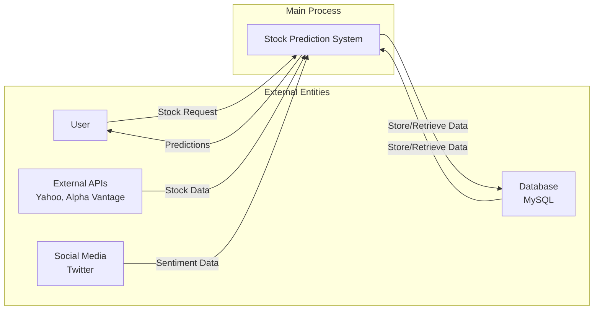

# Data Flow Diagram - Level 0 (Context Diagram)
## Stock Market Prediction Web App

## Data Flows

### External Entities:
1. **User**: 
   - Provides stock symbol requests
   - Receives prediction results and recommendations

2. **External APIs**:
   - Provides real-time stock market data
   - Provides historical price information
   - Provides company financial data

3. **Social Media**:
   - Provides tweets for sentiment analysis
   - Provides news articles
   - Provides market commentary

4. **Database**:
   - Stores user accounts and preferences
   - Stores prediction history
   - Stores model performance metrics
   - Stores processed data

### Main Process:
**Stock Prediction System** - The core system that:
- Receives stock symbol requests from users
- Retrieves data from external sources
- Processes data through ML models
- Analyzes sentiment from social media
- Generates predictions and recommendations
- Stores results in database
- Returns predictions to users