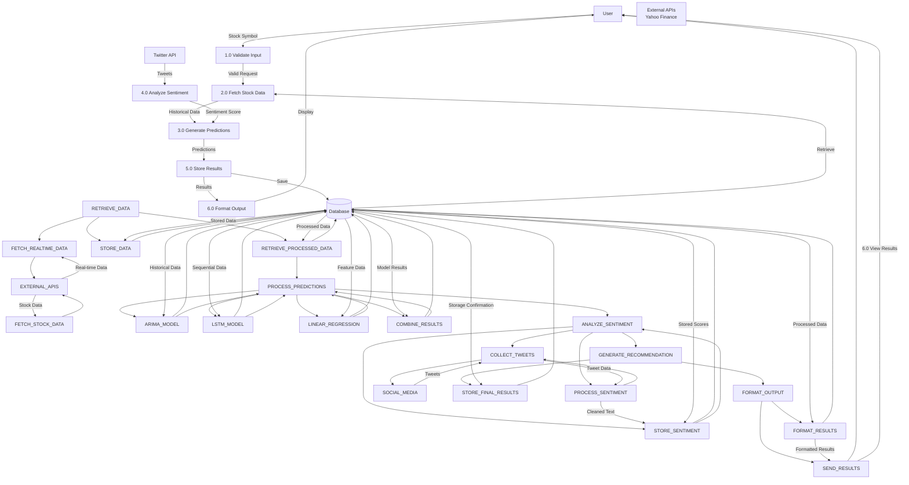

# Data Flow Diagram - Level 1
## Stock Market Prediction Web App

## Process Descriptions

### Process 1.0 - Receive Request
- **1.1 Validate Input**: Check if stock symbol is valid
- **1.2 Log Request**: Record user request for analytics

### Process 2.0 - Retrieve Data
- **2.1 Fetch Stock Data**: Get historical data from APIs
- **2.2 Fetch Real-time Data**: Get current market data
- **2.3 Store Data**: Save retrieved data for processing
- **2.4 Retrieve Data**: Get processed data for models

### Process 3.0 - Process Predictions
- **3.1 ARIMA Model**: Run time series forecasting
- **3.2 LSTM Model**: Run deep learning prediction
- **3.3 Linear Regression**: Run statistical modeling
- **3.4 Combine Results**: Merge predictions from all models

### Process 4.0 - Analyze Sentiment
- **4.1 Collect Tweets**: Gather social media data
- **4.2 Process Sentiment**: Analyze text for sentiment
- **4.3 Store Results**: Save sentiment analysis

### Process 5.0 - Generate Recommendation
- **5.1 Store Results**: Save final predictions

### Process 6.0 - Format Output
- **6.1 Format Output**: Prepare results for display
- **6.2 Send Results**: Return formatted results to user