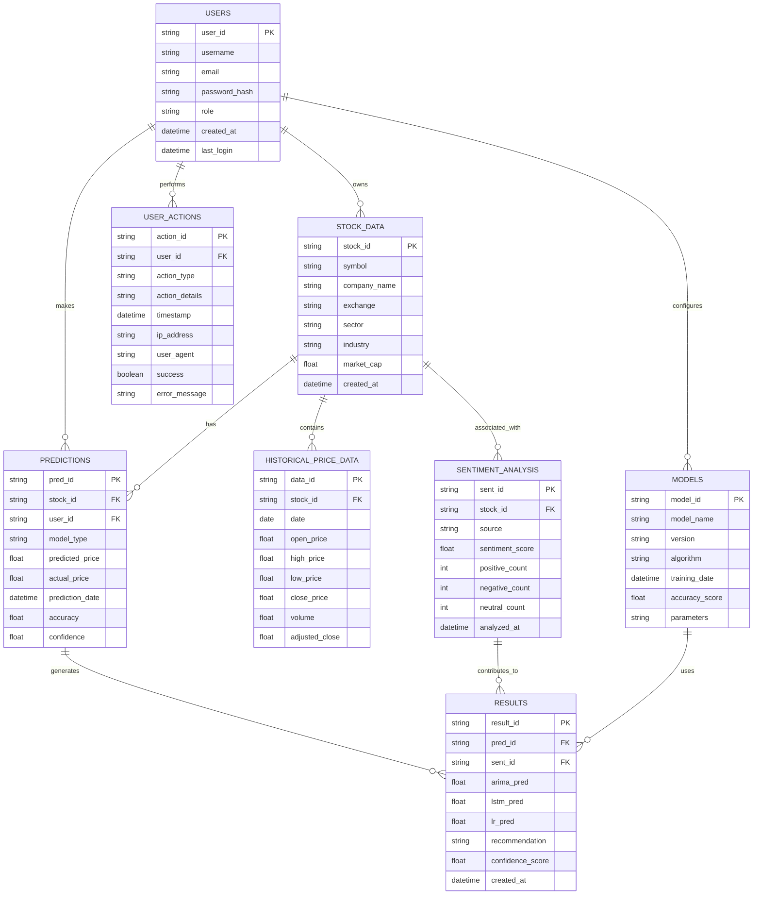

# Entity Relationship Diagram
## Stock Market Prediction Web App

## Entity Descriptions

### Users
- Stores user account information
- Differentiates between admin and regular users
- Tracks login activity and user roles

### Stock Data
- Contains information about stock symbols
- Includes company details and market information
- Links to exchange and sector data

### Predictions
- Stores all prediction results
- Links to users and stock data
- Tracks model performance and accuracy

### Historical Price Data
- Contains actual stock price history
- Used for training models and validating predictions
- Time-series data with OHLCV values

### Sentiment Analysis
- Stores sentiment scores from social media
- Tracks source and analysis timestamps
- Links to specific stocks

### User Actions
- Logs all user interactions with the system
- Tracks successes and errors
- Used for analytics and debugging

### Models
- Contains information about ML models
- Tracks versions and performance metrics
- Stores model parameters

### Results
- Detailed prediction results
- Combines ML predictions with sentiment analysis
- Provides final recommendations