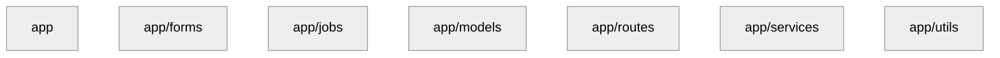

# Package Diagram

## Metadata
- Generated: 2025-11-19 15:11:35.305829
- Generator Version: 0.1.0
- Source Files: 60

## Diagram

## Source Files
- app\cli_commands.py
- app\config.py
- app\__init__.py
- app\forms\auth_forms.py
- app\forms\dividend_forms.py
- app\forms\order_forms.py
- app\forms\portfolio_forms.py
- app\forms\prediction_forms.py
- app\forms\report_forms.py
- app\forms\__init__.py
- app\jobs\dividend_processor.py
- app\jobs\price_updater.py
- app\jobs\scheduler.py
- app\jobs\__init__.py
- app\models\audit_log.py
- app\models\broker.py
- app\models\company.py
- app\models\dividend.py
- app\models\holding.py
- app\models\job_log.py
- app\models\notification.py
- app\models\order.py
- app\models\price_history.py
- app\models\sentiment_cache.py
- app\models\transaction.py
- app\models\user.py
- app\models\wallet.py
- app\models\__init__.py
- app\routes\admin.py
- app\routes\api.py
- app\routes\auth.py
- app\routes\dashboard.py
- app\routes\notifications.py
- app\routes\orders.py
- app\routes\portfolio.py
- app\routes\reports.py
- app\routes\__init__.py
- app\services\admin_service.py
- app\services\audit_service.py
- app\services\auth_service.py
- app\services\dividend_manager.py
- app\services\notification_service.py
- app\services\portfolio_service.py
- app\services\prediction_service.py
- app\services\report_service.py
- app\services\sentiment_engine.py
- app\services\stock_repository.py
- app\services\transaction_engine.py
- app\services\__init__.py
- app\utils\decorators.py
- app\utils\error_handlers.py
- app\utils\exceptions.py
- app\utils\logging_config.py
- app\utils\rate_limiter.py
- app\utils\retry_helper.py
- app\utils\sql_security.py
- app\utils\validators.py
- app\utils\visualization.py
- app\utils\xss_protection.py
- app\utils\__init__.py
