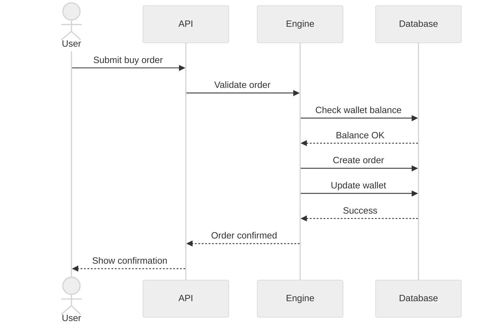

# Sequence Diagram - Buy Order Flow


    User->>Browser: Enter symbol, quantity, price
    Browser->>OrderRoute: POST /orders/buy
    
    OrderRoute->>OrderForm: Validate form data
    OrderForm-->>OrderRoute: Validation result
    
    alt Form Invalid
        OrderRoute-->>Browser: Return errors
        Browser-->>User: Show validation errors
    else Form Valid
        OrderRoute->>TransactionEngine: execute_buy_order(user_id, company_id, quantity, price)
        
        TransactionEngine->>StockRepository: get_current_price(symbol)
        StockRepository->>Database: Query Company
        Database-->>StockRepository: Company data
        StockRepository-->>TransactionEngine: Current price
        
        TransactionEngine->>TransactionEngine: calculate_total_cost(quantity, price, commission)
        
        TransactionEngine->>Wallet: get_user_wallet(user_id)
        Wallet->>Database: Query Wallet
        Database-->>Wallet: Wallet data
        Wallet-->>TransactionEngine: Wallet object
        
        TransactionEngine->>Wallet: has_sufficient_funds(total_cost)
        Wallet-->>TransactionEngine: True/False
        
        alt Insufficient Funds
            TransactionEngine-->>OrderRoute: Raise InsufficientFundsError
            OrderRoute-->>Browser: Error message
            Browser-->>User: "Insufficient funds"
        else Sufficient Funds
            TransactionEngine->>Database: BEGIN TRANSACTION
            
            TransactionEngine->>Wallet: deduct_amount(total_cost)
            Wallet->>Database: UPDATE Wallet SET balance = balance - total_cost
            Database-->>Wallet: Success
            
            TransactionEngine->>Holding: update_or_create(user_id, company_id, quantity, price)
            Holding->>Database: INSERT/UPDATE Holding
            Database-->>Holding: Success
            
            TransactionEngine->>Transaction: create_record(order_details)
            Transaction->>Database: INSERT Transaction
            Database-->>Transaction: transaction_id
            
            TransactionEngine->>Database: COMMIT TRANSACTION
            Database-->>TransactionEngine: Success
            
            TransactionEngine->>NotificationService: send_order_notification(user_id, order)
            NotificationService->>Database: INSERT Notification
            Database-->>NotificationService: Success
            NotificationService-->>TransactionEngine: Notification sent
            
            TransactionEngine-->>OrderRoute: Order executed successfully
            OrderRoute-->>Browser: Success response
            Browser-->>User: "Order executed successfully"
            Browser->>Browser: Redirect to portfolio
        end
    end
```

## Flow Description

### 1. Form Display (Steps 1-5)
- User navigates to buy order page
- System renders form with stock search and quantity input
- Form includes CSRF protection

### 2. Form Submission (Steps 6-8)
- User submits order with symbol, quantity, and price
- Server-side validation checks:
  - Valid stock symbol
  - Quantity > 0
  - Price > 0
  - CSRF token valid

### 3. Order Validation (Steps 9-14)
- Fetch current stock price from repository
- Calculate total cost including commission
- Check wallet balance for sufficient funds

### 4. Transaction Execution (Steps 15-24)
- Begin database transaction for atomicity
- Deduct funds from wallet
- Update or create holding record
- Create transaction record
- Commit transaction

### 5. Post-Processing (Steps 25-28)
- Send notification to user
- Return success response
- Redirect to portfolio page

## Error Handling

### Validation Errors
- Invalid symbol → "Stock not found"
- Invalid quantity → "Quantity must be positive"
- Invalid price → "Price must be positive"

### Business Logic Errors
- Insufficient funds → "Insufficient funds in wallet"
- Stock unavailable → "Stock not available for trading"

### System Errors
- Database error → Rollback transaction
- External API error → Use cached price or fail gracefully

## Security Measures

1. **Authentication**: User must be logged in (@login_required)
2. **CSRF Protection**: All forms include CSRF tokens
3. **Input Validation**: Server-side validation of all inputs
4. **SQL Injection Prevention**: Parameterized queries via ORM
5. **Transaction Atomicity**: Database transactions ensure consistency
