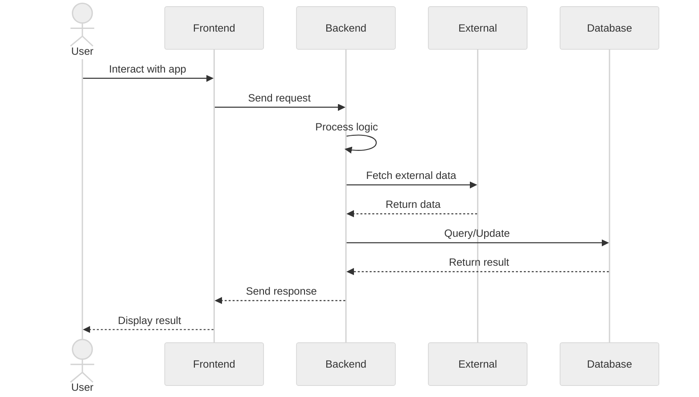

# Sequence Diagram - General System Flow


    YFA-->>DR: 7. Stock data
    DR->>DP: 8. Process data
    DP-->>DR: 9. Cleaned data
    DR-->>FA: 10. Processed data

    FA->>AM: 11. Run prediction
    AM->>DP: 12. Get training data
    DP-->>AM: 13. Historical data
    AM-->>FA: 14. ARIMA prediction

    FA->>LM: 15. Run prediction
    LM->>DP: 16. Get training data
    DP-->>LM: 17. Sequential data
    LM-->>FA: 18. LSTM prediction

    FA->>LRM: 19. Run prediction
    LRM->>DP: 20. Get training data
    DP-->>LRM: 21. Feature data
    LRM-->>FA: 22. LR prediction

    FA->>SA: 23. Analyze sentiment
    SA->>TA: 24. Fetch tweets
    TA-->>SA: 25. Tweet data
    SA->>TP: 26. Process text
    TP-->>SA: 27. Cleaned text
    SA-->>FA: 28. Sentiment score

    FA->>RE: 29. Generate recommendation
    RE->>PC: 30. Combine predictions
    PC-->>RE: 31. Weighted results
    RE->>RA: 32. Assess risk
    RA-->>RE: 33. Risk score
    RE-->>FA: 34. Final recommendation

    FA->>DB: 35. Store results
    DB-->>FA: 36. Storage confirmation
    FA->>CG: 37. Create visualizations
    CG-->>FA: 38. Charts and graphs
    FA->>WB: 39. Render results page
    WB->>U: 40. Display predictions
```

## Detailed Sequence Flow

### Phase 1: User Request and Data Retrieval
1. User enters a stock symbol in the web browser
2. Browser sends HTTP POST request to Flask application
3. Flask app validates the input through Input Validator
4. Input Validator returns validation result
5. If valid, Flask app requests data from Data Retriever
6. Data Retriever calls Yahoo Finance API for stock data
7. Yahoo Finance API returns requested stock information
8. Data Retriever processes data through Data Processor
9. Data Processor cleans and formats the data
10. Data Retriever returns processed data to Flask app

### Phase 2: Machine Learning Predictions
11. Flask app initiates ARIMA model prediction
12. ARIMA Model requests training data from Data Processor
13. Data Processor provides historical data
14. ARIMA Model returns prediction results

15. Flask app initiates LSTM model prediction
16. LSTM Model requests sequential data from Data Processor
17. Data Processor provides time-series data
18. LSTM Model returns prediction results

19. Flask app initiates Linear Regression prediction
20. Linear Regression Model requests feature data from Data Processor
21. Data Processor provides regression features
22. Linear Regression Model returns prediction results

### Phase 3: Sentiment Analysis
23. Flask app initiates sentiment analysis
24. Sentiment Analyzer calls Twitter API for relevant tweets
25. Twitter API returns tweet data
26. Sentiment Analyzer processes text through Text Processor
27. Text Processor returns cleaned text
28. Sentiment Analyzer returns sentiment score

### Phase 4: Recommendation Generation
29. Flask app requests investment recommendation
30. Recommendation Engine combines predictions via Prediction Combiner
31. Prediction Combiner returns weighted results
32. Recommendation Engine assesses risk through Risk Assessor
33. Risk Assessor returns risk evaluation
34. Recommendation Engine returns final recommendation

### Phase 5: Results Delivery
35. Flask app stores results in Database
36. Database confirms successful storage
37. Flask app generates charts through Chart Generator
38. Chart Generator returns visualizations
39. Flask app renders complete results page to browser
40. Browser displays predictions and recommendations to user