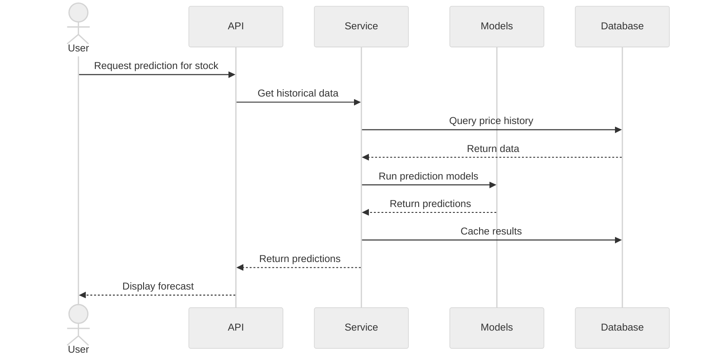

# Sequence Diagram - Stock Price Prediction Flow


    
    User->>Browser: Enter stock symbol
    Browser->>DashboardRoute: POST /dashboard/predict
    
    DashboardRoute->>PredictionForm: Validate form
    PredictionForm-->>DashboardRoute: Valid
    
    DashboardRoute->>PredictionService: predict_stock_price(symbol, days=7)
    
    %% Fetch Historical Data
    PredictionService->>StockRepository: get_historical_prices(symbol, period='1y')
    StockRepository->>Database: Query PriceHistory
    Database-->>StockRepository: Historical data
    
    alt Data Not in DB or Outdated
        StockRepository->>ExternalAPI: fetch_stock_data(symbol)
        ExternalAPI-->>StockRepository: Stock data
        StockRepository->>Database: INSERT PriceHistory
        Database-->>StockRepository: Success
    end
    
    StockRepository-->>PredictionService: Historical prices
    
    %% Parallel Predictions
    par ARIMA Prediction
        PredictionService->>ARIMAModel: predict(historical_data, days=7)
        ARIMAModel->>ARIMAModel: fit_model(data)
        ARIMAModel->>ARIMAModel: forecast(days)
        ARIMAModel-->>PredictionService: ARIMA predictions
    and LSTM Prediction
        PredictionService->>LSTMModel: predict(historical_data, days=7)
        LSTMModel->>LSTMModel: prepare_sequences(data)
        LSTMModel->>LSTMModel: load_or_train_model()
        LSTMModel->>LSTMModel: predict_future(days)
        LSTMModel-->>PredictionService: LSTM predictions
    and Linear Regression
        PredictionService->>LinearModel: predict(historical_data, days=7)
        LinearModel->>LinearModel: fit_model(data)
        LinearModel->>LinearModel: extrapolate(days)
        LinearModel-->>PredictionService: Linear predictions
    end
    
    %% Sentiment Analysis
    PredictionService->>SentimentEngine: analyze_sentiment(symbol)
    
    SentimentEngine->>Cache: get_cached_sentiment(symbol)
    Cache->>Database: Query SentimentCache
    Database-->>Cache: Cached data
    Cache-->>SentimentEngine: Cached sentiment or None
    
    alt Cache Miss or Expired
        SentimentEngine->>ExternalAPI: fetch_tweets(symbol, count=100)
        ExternalAPI-->>SentimentEngine: Tweets
        
        SentimentEngine->>SentimentEngine: calculate_sentiment_score(tweets)
        
        SentimentEngine->>Cache: cache_sentiment(symbol, score)
        Cache->>Database: INSERT/UPDATE SentimentCache
        Database-->>Cache: Success
    end
    
    SentimentEngine-->>PredictionService: Sentiment score
    
    %% Combine Predictions
    PredictionService->>PredictionService: combine_predictions(arima, lstm, linear, sentiment)
    PredictionService->>PredictionService: calculate_confidence_intervals()
    PredictionService->>PredictionService: generate_recommendation()
    
    PredictionService-->>DashboardRoute: Prediction results
    
    DashboardRoute->>DashboardRoute: prepare_chart_data(predictions)
    DashboardRoute-->>Browser: Render predictions with charts
    Browser-->>User: Display prediction results
```

## Flow Description

### 1. Request Initiation (Steps 1-6)
- User accesses dashboard and enters stock symbol
- Form validation ensures valid symbol format

### 2. Data Fetching (Steps 7-13)
- Retrieve historical price data from database
- If data missing or outdated, fetch from external API (yfinance)
- Store fetched data for future use

### 3. Parallel Model Execution (Steps 14-22)
Three ML models run in parallel:

**ARIMA Model**
- Time series forecasting
- Captures trends and seasonality
- Best for short-term predictions

**LSTM Model**
- Deep learning approach
- Learns complex patterns
- Better for volatile stocks

**Linear Regression**
- Simple trend extrapolation
- Fast computation
- Baseline prediction

### 4. Sentiment Analysis (Steps 23-31)
- Check cache for recent sentiment data
- If cache miss, fetch tweets from Twitter API
- Calculate sentiment score using TextBlob
- Cache results for 1 hour

### 5. Prediction Combination (Steps 32-35)
- Weighted average of model predictions
- Sentiment score adjusts final prediction
- Calculate confidence intervals
- Generate buy/hold/sell recommendation

### 6. Visualization (Steps 36-38)
- Prepare chart data for frontend
- Include historical prices and predictions
- Display confidence bands

## Model Weights

Default prediction combination:
- ARIMA: 30%
- LSTM: 40%
- Linear Regression: 20%
- Sentiment Adjustment: 10%

## Caching Strategy

### Price Data
- Cached in database (PriceHistory table)
- Updated daily by background job
- On-demand fetch if missing

### Sentiment Data
- Cached in database (SentimentCache table)
- TTL: 1 hour
- Reduces API calls to Twitter

## Error Handling

### Data Errors
- Symbol not found → "Invalid stock symbol"
- Insufficient historical data → "Not enough data for prediction"

### Model Errors
- Model training failure → Fall back to simpler models
- API rate limit → Use cached data or skip sentiment

### External API Errors
- yfinance timeout → Use cached prices
- Twitter API error → Skip sentiment analysis

## Performance Optimizations

1. **Parallel Processing**: Models run concurrently
2. **Caching**: Reduce external API calls
3. **Lazy Loading**: Only fetch data when needed
4. **Background Jobs**: Pre-fetch popular stocks
