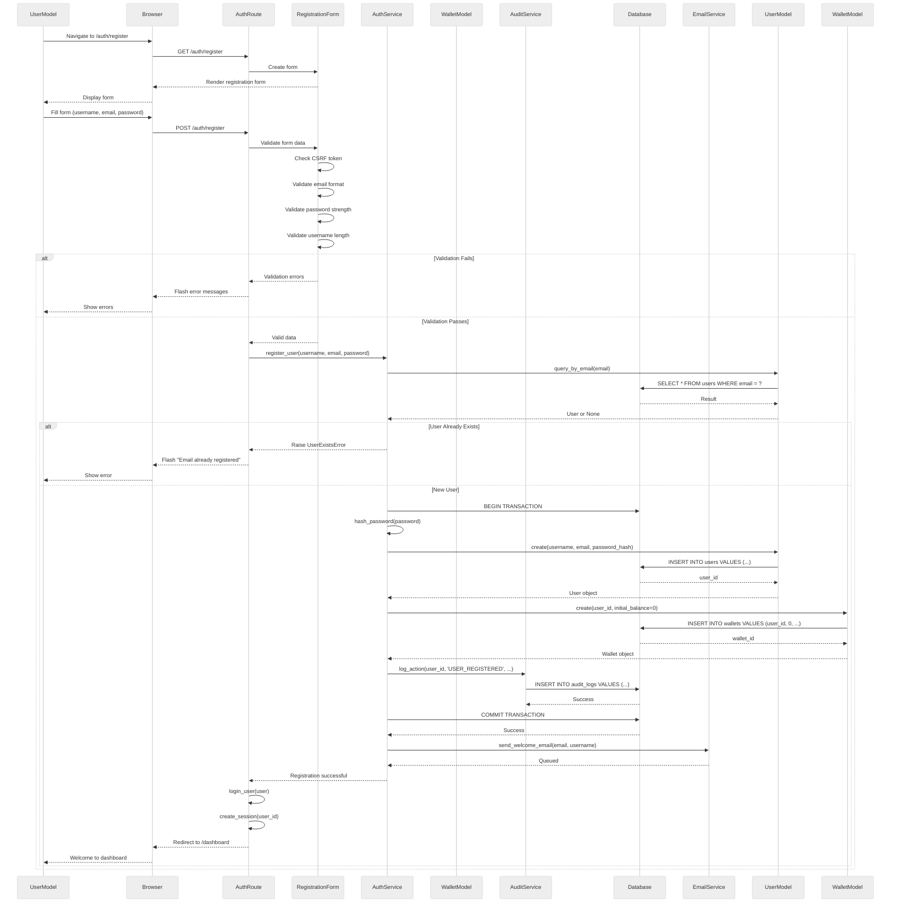

# Sequence Diagram - User Registration Flow

## Metadata
- Generated: 2025-11-19
- Generator: Manual
- Scenario: New user registration with wallet creation

## Diagram



## Flow Description

### 1. Form Display (Steps 1-5)
- User navigates to registration page
- System renders form with CSRF protection
- Form includes: username, email, password, confirm password

### 2. Client-Side Validation (Step 6)
Browser validates:
- All fields filled
- Email format
- Password match
- Password minimum length

### 3. Server-Side Validation (Steps 7-12)
**CSRF Protection**
- Validates CSRF token to prevent cross-site attacks

**Email Validation**
- Format: valid email pattern
- Uniqueness: not already registered

**Password Validation**
- Minimum 8 characters
- Contains uppercase, lowercase, number
- Not in common password list

**Username Validation**
- 3-50 characters
- Alphanumeric and underscores only

### 4. User Creation (Steps 13-28)
**Database Transaction**
- Ensures atomicity of user + wallet creation
- Rollback on any failure

**Password Security**
- Hash password using bcrypt
- Salt automatically generated
- Never store plain text

**Wallet Initialization**
- Create wallet with $0 balance
- Link to user account
- Ready for deposits

**Audit Logging**
- Record registration event
- Store IP address
- Timestamp for compliance

### 5. Post-Registration (Steps 29-34)
**Welcome Email**
- Sent asynchronously
- Contains account details
- Verification link (if enabled)

**Auto-Login**
- Create session for user
- Set secure cookie
- Redirect to dashboard

## Security Measures

### Password Security
```python
# Bcrypt with salt
password_hash = bcrypt.generate_password_hash(password)
```

### CSRF Protection
```python
# Flask-WTF automatic CSRF
form = RegistrationForm()
if form.validate_on_submit():
    # Process registration
```

### SQL Injection Prevention
```python
# SQLAlchemy ORM parameterized queries
User.query.filter_by(email=email).first()
```

### Session Security
- Secure cookie flag
- HttpOnly flag
- SameSite=Lax
- Session timeout: 24 hours

## Validation Rules

### Email
- Format: RFC 5322 compliant
- Max length: 255 characters
- Case-insensitive uniqueness

### Password
- Min length: 8 characters
- Must contain:
  - At least 1 uppercase letter
  - At least 1 lowercase letter
  - At least 1 number
  - At least 1 special character (optional)

### Username
- Length: 3-50 characters
- Allowed: a-z, A-Z, 0-9, underscore
- Unique (case-insensitive)

## Error Messages

User-friendly messages without revealing system details:

- "Email already registered" (not "User exists in database")
- "Invalid email format" (not "Email regex failed")
- "Password too weak" (not "Password must contain...")

## Database Transaction

```sql
BEGIN TRANSACTION;
  INSERT INTO users (...) VALUES (...);
  INSERT INTO wallets (user_id, balance) VALUES (?, 0);
  INSERT INTO audit_logs (...) VALUES (...);
COMMIT;
```

If any step fails, entire transaction rolls back.

## Async Operations

Welcome email sent asynchronously to avoid blocking:
- User doesn't wait for email delivery
- Faster registration experience
- Email failures don't break registration
