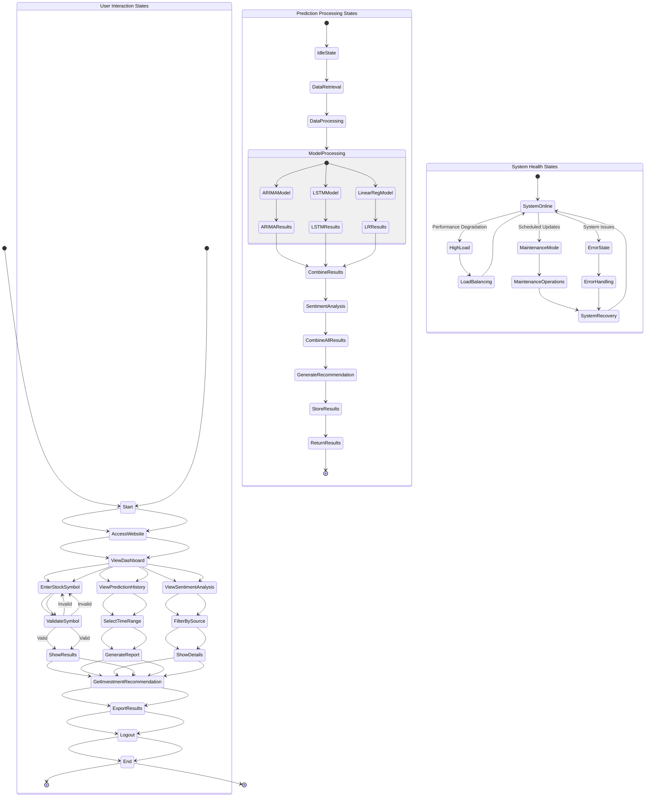

# State Chart Diagram
## Stock Market Prediction Web App

## State Descriptions

### User Interaction States
Represents the user journey through the application:
1. **Start**: Initial access point
2. **Access Website**: Login or registration process
3. **View Dashboard**: Main overview of available features
4. **Enter Stock Symbol**: Input for prediction request
5. **Validate Symbol**: System checks symbol validity
6. **Show Results**: Display prediction outcomes
7. **Get Investment Recommendation**: Receive actionable advice
8. **Export Results**: Save data in various formats
9. **Logout**: End user session
10. **End**: Final state

### Prediction Processing States
Represents the internal processing flow:
1. **Idle State**: Waiting for user requests
2. **Data Retrieval**: Fetching stock information from APIs
3. **Data Processing**: Cleaning and validating data
4. **Model Processing**: Running predictions through all three ML models
5. **Combine Results**: Merging predictions with weighted averages
6. **Sentiment Analysis**: Processing social media sentiment
7. **Generate Recommendation**: Creating investment advice
8. **Store Results**: Saving to database
9. **Return Results**: Sending to user interface

### System Health States
Represents system operational states:
1. **System Online**: Normal operations
2. **High Load**: Performance degradation handling
3. **Maintenance Mode**: Scheduled updates and repairs
4. **Error State**: System issues and failures
5. **Load Balancing**: Distributing requests during high load
6. **Maintenance Operations**: Database backup and restore
7. **Error Handling**: Logging and recovery processes
8. **System Recovery**: Return to normal operations