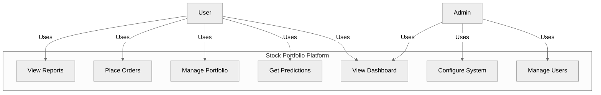

# Use Case Diagram


    SYSTEM_INTERNAL --> UC16[Generate Charts]
    SYSTEM_INTERNAL --> UC17[Store Results]
    SYSTEM_INTERNAL --> UC18[Send Notifications]

    UC1 --> SYSTEM
    UC2 --> SYSTEM
    UC3 --> SYSTEM
    UC4 --> SYSTEM
    UC5 --> SYSTEM
    UC6 --> SYSTEM
    UC7 --> SYSTEM
    UC8 --> SYSTEM
    UC9 --> SYSTEM
    UC10 --> SYSTEM
    UC11 --> SYSTEM
    UC12 --> SYSTEM
    UC13 --> SYSTEM
    UC14 --> SYSTEM
    UC15 --> SYSTEM
    UC16 --> SYSTEM
    UC17 --> SYSTEM
    UC18 --> SYSTEM
```

## Use Case Descriptions

### User Role Use Cases:
1. **View Stock Dashboard** - Access the main dashboard with stock information
2. **Enter Stock Symbol** - Input stock symbol for prediction
3. **View Predictions** - See ML model predictions for selected stock
4. **View Sentiment Data** - View social media sentiment analysis
5. **Get Recommendation** - Receive investment recommendation
6. **Export Data** - Export prediction results to file

### Admin Role Use Cases:
1. **Manage User Accounts** - Create, update, delete user accounts
2. **View System Logs** - Monitor system activity and errors
3. **Configure Models** - Adjust ML model parameters
4. **Manage API Keys** - Update and manage external API keys
5. **Monitor Performance** - Track system and model performance
6. **Backup Database** - Create database backups

### System Role Use Cases:
1. **Retrieve Stock Data** - Fetch stock data from external APIs
2. **Process Predictions** - Run ML models on stock data
3. **Analyze Sentiment** - Process social media sentiment
4. **Generate Charts** - Create data visualizations
5. **Store Results** - Save prediction results to database
6. **Send Notifications** - Send alerts and updates